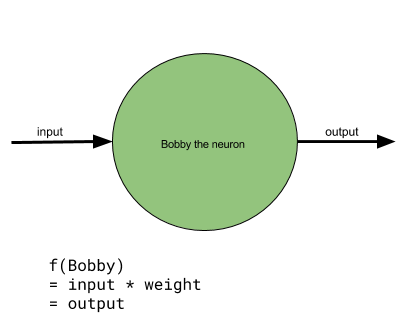

# Basics of Tensorflow
## Official guide
* [Getting Started with Tensorflow](https://www.tensorflow.org/get_started/get_started)
## Prerequisites  
* [Install Python](https://www.python.org/downloads/) (doesn't matter 2.7 or 3.n)  
* [Install Tensorflow](https://www.tensorflow.org/install/)   

## Getting Started (Part I)
1. Open Python in terminal.
```
$ python
```

2. Import tensorflow.
```
>>> Import tensorflow as tf
```

3. The basic components of Tensorflow:  
* Graph - a collection of ops that may be executed together as a group.  
* Operations - nodes in Tensorflow graph.  

Run below commands and you will see currently there is nothing in the graph now.
```
>>> g = tf.get_default_graph()
>>> g.get_operations()
## []
```

4. Create a constant-type tensor, which value is immutable. It will also act as a node/operation in our graph.
```
>>> input = tf.constant(1.2)
```

5. Run below commands to see information of nodes/operations in the graph.
```
>>> o = g.get_operations()
>>> o
## [<tensorflow.python.framework.ops.Operation at 0x1185005d0>]
>>> o[0].node_def
## name: "Const"
## op: "Const"
## attr {
##   key: "dtype"
##   value {
## 	type: DT_FLOAT
##   }
## }
## attr {
##   key: "value"
##   value {
## 	tensor {
##   	dtype: DT_FLOAT
##   	tensor_shape {
##   	}
##   	float_val: 1.20000004768
## 	}
##   }
## }
```

6. Key in the constant name and it will show us the tensor information but not the value of it.
```
>>> input
## <tf.Tensor 'Const:0' shape=() dtype=float32>
```

7. To view the value, we have to evaluate ```input``` by creating a session to run on it.
```
>>> sess = tf.Session()
>>> sess.run(input)
## 1.2
```

8. Create a variable-type tensor.
```
>>> weight = tf.Variable(0.8)
```

9. Let's inspect the operations in our graph again. Notice that we have more that 2 operations!
```
>>> o = g.get_operations()
>>> for ol in o: print(ol.name)
## Const
## Variable/initial_value
## Variable
## Variable/Assign
## Variable/read
```

10. Let's perform some computation and inspect on the last operation.
```
>>> output = weight * input
>>> o = g.get_operations()[-1]
>>> o.name
## 'mul'
>>> for olist in o.inputs: print(olist)
## Tensor("Variable/read:0", shape=(), dtype=float32)
## Tensor("Const:0", shape=(), dtype=float32)
```

11. To get the result of the computation, we have to first 'initialize' the variable.
```
>>> init = tf.global_variables_initializer()
>>> sess.run(init)
```

12. Now we are ready to run the operation.
```
>>> sess.run(output)
## 0.80000001
```

13. We can use Tensorboard to generate the graph.
```
>>> summary_writer = tf.summary.FileWriter('log_simple_graph', sess.graph)
```

14. Open another new session of terminal and run below command.
```
$ tensorboard --logdir=log_simple_graph
```

15. Go to localhost:6006 to view our graph.

## Conclusion (Part I)
We have perform a basic math function using Tensorflow. Reason we use such a lengthy method to do a multiplication, is to understand the concepts of the Tensorflow framework before even hands on the neural networks.

## Getting Started (Parted II)
1. Launch Python in terminal and import Tensorflow.
```
>>> Import tensorflow as tf
```

2. Define the **input**, **output** & **weight**.
```
>>> x = tf.constant(1.0, name='input')
>>> w = tf.Variable(0.8, name='weight')
>>> y = tf.multiply(w, x, name='output')
```

3. The combination of **xyz** we can understand it as a single neuron:


4. Define **target label**.
```
y_ = tf.constant(7.5)
```

4. Define **loss**.
```
loss = tf.pow(y - y_, 2, name='loss')
```

5. Construct a new gradient descent optimizer, pass in a floating point value as argument.
```
>>> optimizer = tf.train.GradientDescentOptimizer(learning_rate=0.025)
```

6. Compute gradients of loss for the variables in var_list. Return a list of (gradient, variable) pairs.
```
>>> grads_and_vars = optimizer.compute_gradients(loss)
```

7. Initialize variables and display result of *grads_and_vars*.
```
>>> sess.run(tf.global_variables_initializer())
>>> sess.run(grads_and_vars[1][0])
```

8. Apply gradients to variables.
```
>>> sess.run(optimizer.apply_gradients(grads_and_vars))
>>> sess.run(w)
```

9. The *minimize()* method simply combines calls *compute_gradients()* and *apply_gradients()*. If you want to process the gradient before applying them call compute_gradients() and apply_gradients() explicitly instead of using this function.

10. We will iterate this process 100 times, going forward and backward updating the weight in order to have an output that is closer to the target label. The backward is what we called **Backpropagation**.
```
>>> train_step = tf.train.GradientDescentOptimizer(0.025).minimize(loss)
>>> for i in range(100):
... 	sess.run(train_step)
...
>>> sess.run(y)
```

10. Print result for every training steps.
```
>>> sess.run(tf.global_variables_initializer())
>>> for i in range(100):
... 	print('before step {}, y is {}'.format(i, sess.run(y)))
... 	sess.run(train_step)
...
```

11. Plot graph.
```
>>> summary_y = tf.summary.scalar('output', y)
>>> summary_writer = tf.summary.FileWriter('log_simple_stats')
>>> sess.run(tf.global_variables_initializer())
>>> for i in range(100):
... 	summary_str = sess.run(summary_y)
... 	summary_writer.add_summary(summary_str, i)
... 	sess.run(train_step)
...
$ tensorboard --logdir=log_simple_stats
```

## Conclusion (Part II)
We had completed a simple Artificial Neural Network with a single neuron. By giving a target label of 7.5, our model able to accept ~~any~~ certain input, gone through the training process and eventually produce an output that is close to our target label.

Input=1, target label=7.5
```
before step 0, y is 0.800000011921
before step 1, y is 1.13499999046
before step 2, y is 1.45324993134
before step 3, y is 1.75558745861
before step 4, y is 2.04280805588
before step 5, y is 2.31566762924
.
.
before step 170, y is 7.49890613556
before step 171, y is 7.49896097183
before step 172, y is 7.49901294708
before step 173, y is 7.49906253815
before step 174, y is 7.49910926819
before step 175, y is 7.49915361404
```

However, some test case may not even come close to our expected result. This is what we going to try on next with a  **Deep Neural Network** model.

Input=0.3, target label=7.5
```
before step 0, y is 0.240000009537
before step 1, y is 0.272670030594
before step 2, y is 0.305193006992
before step 3, y is 0.337569653988
before step 4, y is 0.369800567627
before step 5, y is 0.401886492968
.
.
before step 190, y is 4.41839647293
before step 191, y is 4.43226337433
before step 192, y is 4.4460682869
before step 193, y is 4.4598107338
before step 194, y is 4.4734916687
before step 195, y is 4.48711109161
```
